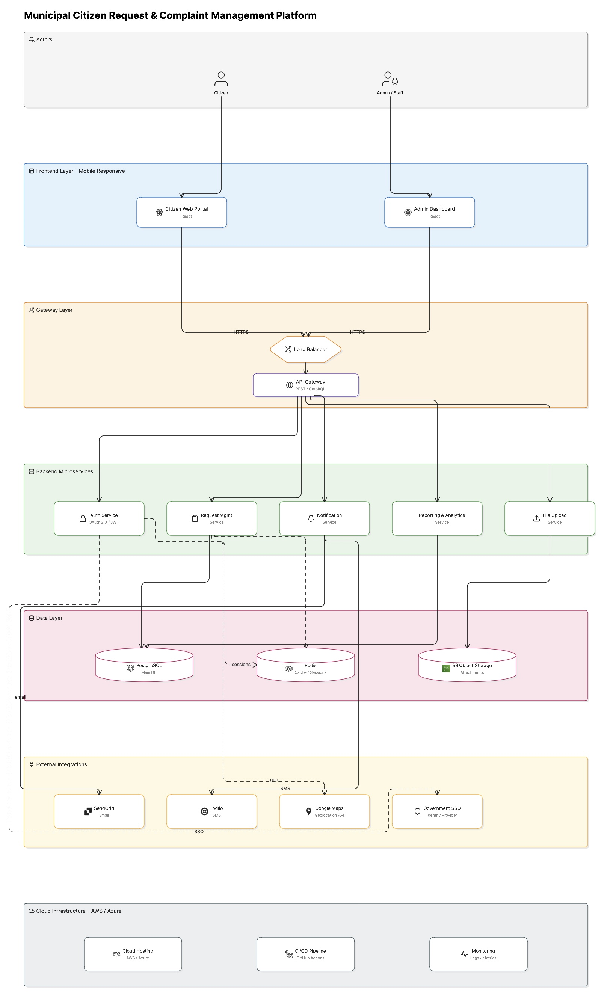

# municipal-request-platform

## Integrantes:
- María Paula Rodríguez 
- Santiago Carmona Pineda

### Arquitectura del Sistema — Plataforma Municipal de Gestión de Solicitudes Ciudadanas

La plataforma está diseñada bajo una arquitectura de microservicios en capas, lo que garantiza modularidad, escalabilidad e independencia entre componentes. A continuación se describe cada capa del sistema.
1. **Capa de Actores:**
El sistema contempla dos tipos de usuarios: el ciudadano, quien interactúa con la plataforma para registrar solicitudes, adjuntar evidencias y hacer seguimiento a sus casos; y el administrador/funcionario municipal, quien gestiona las solicitudes, las asigna a dependencias y monitorea el desempeño operativo.

2. **Capa Frontend:**
El frontend está compuesto por dos aplicaciones web, ambas con diseño adaptable a dispositivos móviles. El Portal Ciudadano permite a los ciudadanos registrar solicitudes, consultar su estado y comunicarse con las autoridades. El Panel Administrativo ofrece a los funcionarios herramientas para gestionar solicitudes, asignar tareas a departamentos y generar reportes de desempeño.

3. **Capa de Gateway:**
Toda comunicación entre el frontend y el backend pasa obligatoriamente por esta capa. El Load Balancer distribuye el tráfico entrante de forma equitativa entre los servidores disponibles, garantizando disponibilidad y rendimiento. El API Gateway (REST/GraphQL) actúa como punto de entrada único al backend, encargándose del enrutamiento de peticiones, control de acceso y gestión de versiones de la API.

4. **Capa de Microservicios Backend:**
El backend está organizado en cinco microservicios independientes, cada uno con una responsabilidad bien definida:

    - **Auth Service:** Gestiona la autenticación y autorización de usuarios mediante OAuth 2.0 y tokens JWT, integrándose con el proveedor de identidad gubernamental vía SSO.

    - **Request Management Service:** Es el núcleo del sistema. Administra el ciclo de vida completo de las solicitudes ciudadanas, desde su creación hasta su resolución.

    - **Notification Service:** Envía alertas y actualizaciones a los ciudadanos a través de correo electrónico (SendGrid) y mensajes de texto (Twilio).

    - **Reporting & Analytics Service:** Genera reportes de desempeño, tiempos de resolución y estadísticas operativas para los administradores.

    - **File Upload Service:** Gestiona la carga y almacenamiento de archivos adjuntos como fotografías o documentos relacionados con las solicitudes.
    

5. **Capa de Datos:**
La persistencia de información se gestiona mediante tres tecnologías complementarias. PostgreSQL es la base de datos relacional principal, donde se almacenan solicitudes, usuarios y registros del sistema. Redis actúa como caché de alta velocidad y gestor de sesiones activas, reduciendo la carga sobre la base de datos principal. S3 Object Storage almacena los archivos adjuntos subidos por los ciudadanos, como imágenes o documentos de soporte.
6. **Integraciones con Terceros:**
El sistema se conecta con servicios externos para ampliar sus capacidades: SendGrid para el envío de notificaciones por correo electrónico, Twilio para notificaciones por SMS, Google Maps API para la geolocalización de las solicitudes en el mapa municipal, y el Proveedor de Identidad Gubernamental (SSO) para la autenticación unificada de funcionarios públicos.
7. **Infraestructura Cloud (AWS / Azure):**
Toda la plataforma está desplegada en la nube, lo que garantiza alta disponibilidad y escalabilidad. Se utiliza Cloud Hosting (AWS o Azure) como proveedor de infraestructura, un Pipeline CI/CD con GitHub Actions para la integración y despliegue continuo de nuevas versiones, y herramientas de Monitoreo para el registro de logs y métricas de rendimiento en tiempo real.

### Punto 2: Agile Product Backlog (User Story Mapping)

#### Épicas e Historias de Usuario

El backlog está organizado en **8 épicas**, priorizadas usando **MoSCoW** (Must Have / Should Have / Could Have). La estimación de esfuerzo se realizó con la escala de Fibonacci mediante **Planning Poker**.

| Prioridad | Etiqueta | Descripción |
|-----------|----------|-------------|
| 🔴 Must Have | Obligatorio | Sin esto el sistema no funciona |
| 🟡 Should Have | Importante | Alta prioridad pero no bloqueante |
| 🟢 Could Have | Deseable | Incluir si el tiempo lo permite |

---

#### EP1 — Autenticación & SSO (24 SP)

| ID | Historia de Usuario | Actor | MoSCoW | SP |
|----|---------------------|-------|--------|----|
| US-01 | Registro de ciudadano (email + contraseña) | Ciudadano | Must Have | 5 |
| US-02 | Login de ciudadano | Ciudadano | Must Have | 3 |
| US-03 | Recuperación de contraseña | Ciudadano | Must Have | 3 |
| US-04 | Login de funcionario vía SSO (Gov. IdP) | Admin/Staff | Must Have | 8 |
| US-05 | Control de acceso por roles (RBAC) | Admin/Staff | Must Have | 5 |

#### EP2 — Portal Ciudadano (37 SP)

| ID | Historia de Usuario | Actor | MoSCoW | SP |
|----|---------------------|-------|--------|----|
| US-06 | Enviar nueva solicitud de servicio | Ciudadano | Must Have | 8 |
| US-07 | Adjuntar fotos / documentos | Ciudadano | Must Have | 5 |
| US-08 | Geolocalizar solicitud en mapa | Ciudadano | Must Have | 8 |
| US-09 | Ver estado e historial de solicitud | Ciudadano | Must Have | 5 |
| US-10 | Recibir notificación por email ante actualización | Ciudadano | Must Have | 5 |
| US-11 | Recibir notificación por SMS | Ciudadano | Should Have | 3 |
| US-12 | Buscar y filtrar mis solicitudes | Ciudadano | Should Have | 3 |

#### EP3 — Panel Administrativo (37 SP)

| ID | Historia de Usuario | Actor | MoSCoW | SP |
|----|---------------------|-------|--------|----|
| US-13 | Ver todas las solicitudes entrantes | Admin/Staff | Must Have | 5 |
| US-14 | Asignar solicitud a dependencia | Admin/Staff | Must Have | 8 |
| US-15 | Actualizar estado de solicitud | Admin/Staff | Must Have | 5 |
| US-16 | Agregar comentarios internos | Admin/Staff | Must Have | 3 |
| US-17 | Filtrar y buscar solicitudes | Admin/Staff | Should Have | 5 |
| US-18 | Ver KPIs de tiempos de resolución | Admin/Staff | Should Have | 8 |
| US-19 | Exportar solicitudes a CSV/Excel | Admin/Staff | Could Have | 3 |

#### EP4 — Reportes & Analytics (26 SP)

| ID | Historia de Usuario | Actor | MoSCoW | SP |
|----|---------------------|-------|--------|----|
| US-20 | Generar reporte de desempeño | Admin/Staff | Should Have | 8 |
| US-21 | Gráficas de solicitudes por tipo/dependencia | Admin/Staff | Should Have | 8 |
| US-22 | Tiempo promedio de resolución por dependencia | Admin/Staff | Should Have | 5 |
| US-23 | Exportar reporte como PDF | Admin/Staff | Could Have | 5 |

#### EP5 — Servicio de Notificaciones (13 SP)

| ID | Historia de Usuario | Actor | MoSCoW | SP |
|----|---------------------|-------|--------|----|
| US-24 | Email de confirmación al crear solicitud | Ciudadano | Must Have | 3 |
| US-25 | Digest diario para funcionarios | Admin/Staff | Should Have | 5 |
| US-26 | Alerta SMS para solicitudes críticas | Ciudadano | Could Have | 5 |

#### EP6 — Gestión de Archivos (16 SP)

| ID | Historia de Usuario | Actor | MoSCoW | SP |
|----|---------------------|-------|--------|----|
| US-27 | Subir imágenes hasta 10 MB | Ciudadano | Must Have | 5 |
| US-28 | Validar tipo de archivo (jpg, png, pdf) | Ciudadano | Must Have | 3 |
| US-29 | Almacenar archivos en S3 | Sistema | Must Have | 5 |
| US-30 | Administrador descarga adjuntos | Admin/Staff | Must Have | 3 |

#### EP7 — Infraestructura & DevOps (42 SP)

| ID | Historia de Usuario | Actor | MoSCoW | SP |
|----|---------------------|-------|--------|----|
| US-31 | Configurar pipeline CI/CD (GitHub Actions) | DevOps | Must Have | 8 |
| US-32 | Aprovisionar cloud hosting (AWS/Azure) | DevOps | Must Have | 8 |
| US-33 | Configurar PostgreSQL & Redis | DevOps | Must Have | 5 |
| US-34 | Configurar S3 + roles IAM | DevOps | Must Have | 5 |
| US-35 | Monitoreo y alertas (logs/métricas) | DevOps | Should Have | 8 |
| US-36 | Load balancer y auto-scaling | DevOps | Should Have | 8 |

#### EP8 — QA & Testing (42 SP)

| ID | Historia de Usuario | Actor | MoSCoW | SP |
|----|---------------------|-------|--------|----|
| US-37 | Pruebas unitarias (>80% cobertura) — Auth | QA | Must Have | 5 |
| US-38 | Pruebas de integración — API Gateway | QA | Must Have | 5 |
| US-39 | Pruebas E2E — flujo de envío de solicitud | QA | Must Have | 8 |
| US-40 | Prueba de carga (500 usuarios concurrentes) | QA | Should Have | 8 |
| US-41 | Auditoría de accesibilidad (WCAG 2.1) | QA | Could Have | 5 |
| US-42 | Pentest & escaneo de vulnerabilidades | QA | Must Have | 8 |

---

> **Total Story Points: 312 SP** distribuidos en 7 sprints de 2 semanas (velocidad objetivo: 40 SP/sprint).

---

### Punto 3: Presupuesto de Desarrollo

La estimación sigue la metodología Scrum: **Story Points → Velocidad → Número de Sprints → Costo por Sprint → Presupuesto Total**.

#### Supuestos clave

- Sprint de **2 semanas**; velocidad de **40 SP/sprint** (sprint 1: 30 SP de ramp-up).
- Equipo de **9 personas** basado en Latinoamérica (tarifas competitivas en USD).
- **15% de contingencia** sobre labor para cambios de alcance y retrabajo.
- Costos de tecnología: estimación anual basada en uso promedio (Año 1).

#### Composición del equipo

| Rol | # | Tarifa Semanal | Costo por Sprint |
|-----|---|----------------|-----------------|
| Project Manager | 1 | $1,800 | $3,600 |
| Frontend Developer | 2 | $1,600 c/u | $6,400 |
| Backend Developer | 3 | $1,700 c/u | $10,200 |
| DevOps / Cloud Engineer | 1 | $1,900 | $3,800 |
| QA Engineer | 1 | $1,400 | $2,800 |
| UI/UX Designer | 1 | $1,500 | $3,000 (sprints 1-4) |
| **TOTAL** | **9** | | **$29,800/sprint** |

#### Plan de Sprints

| Sprint | Semanas | Foco | SP | Costo (USD) |
|--------|---------|------|----|-------------|
| Sprint 1 | 1–2 | Infra + Auth básica (CI/CD, DB, registro) | 30 | $29,800 |
| Sprint 2 | 3–4 | Auth SSO + envío de solicitud + panel admin | 40 | $29,800 |
| Sprint 3 | 5–6 | Portal ciudadano MVP (mapa, adjuntos, estado) | 40 | $29,800 |
| Sprint 4 | 7–8 | Notificaciones + filtros + pruebas E2E | 40 | $29,800 |
| Sprint 5 | 9–10 | Analytics + reportes + KPIs | 40 | $29,800 |
| Sprint 6 | 11–12 | Operaciones, monitoreo, prueba de carga | 40 | $29,800 |
| Sprint 7 | 13–14 | UAT, pentest, despliegue a producción | 42 | $29,800 |
| **TOTAL** | **14 semanas** | | **312 SP** | **$208,600** |

#### Resumen Presupuestario

| Categoría | Estimado Bajo | Estimado Base | Estimado Alto |
|-----------|--------------|---------------|---------------|
| Labor — Desarrollo (7 sprints) | $177,310 | $208,600 | $238,400 |
| Tecnología & Cloud (Año 1) | $14,760 | $18,450 | $22,140 |
| QA & Auditoría de Seguridad | $3,000 | $3,500 | $5,000 |
| Contingencia (15% sobre labor) | $17,731 | $31,290 | $47,680 |
| Gestión de Proyecto (overhead) | $10,430 | $16,688 | $23,840 |
| **GRAN TOTAL** | **$223,231** | **$278,528** | **$337,060** |

> Ver el archivo Excel adjunto (`Municipal_Platform_Budget.xlsx`) para el modelo completo con todas las fórmulas dinámicas, desglose por épica y hoja de costos tecnológicos.

---